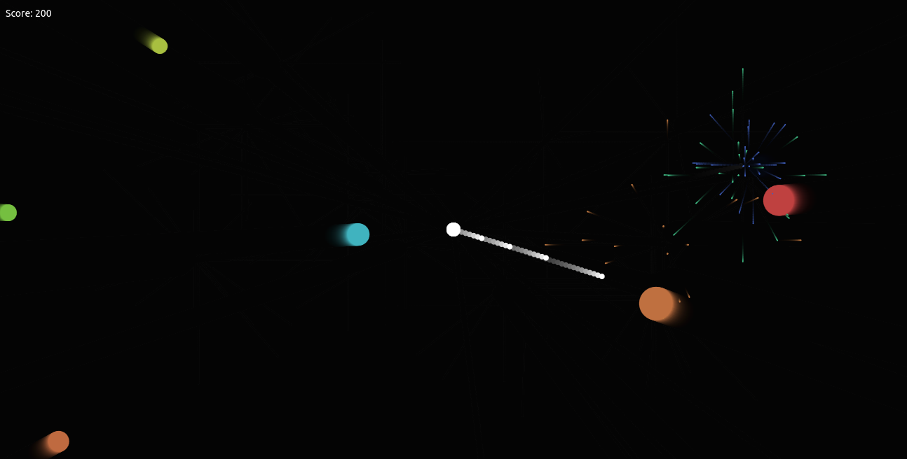
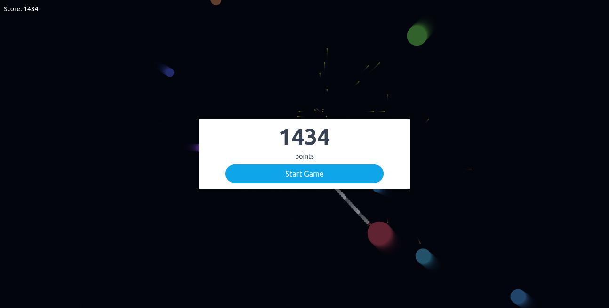

# Canvas Shooting Mini Game

## Project Description

> A mini shooter game built using canvas concepts in which a player shoots enemies moving towards them by clicking on the canvas.

## 🔧 Built with

- Vanilla JS
- HTML & CSS
- TailwindCSS
- Webpack

## Screenshots

## 🔴 Live Demo

- [Shooting mini game](https://shooting-mini-game.netlify.app)

## Get started on local machine

**_Please check the `Canvas-Projects` README file to find out how to get this project started on your local machine_**.

## 🤝 Contributions

**_Please check the `Canvas-Projects` README file to find out how to contribute to this project_**.

## ✒️ Authors

👤 **Roy Ntaate**

- Github: [@RNtaate](https://github.com/RNtaate)

- Linkedin: [roy-ntaate](https://linkedin.com/in/roy-ntaate)

## Show your support

Give a ⭐️ if you like this project!
